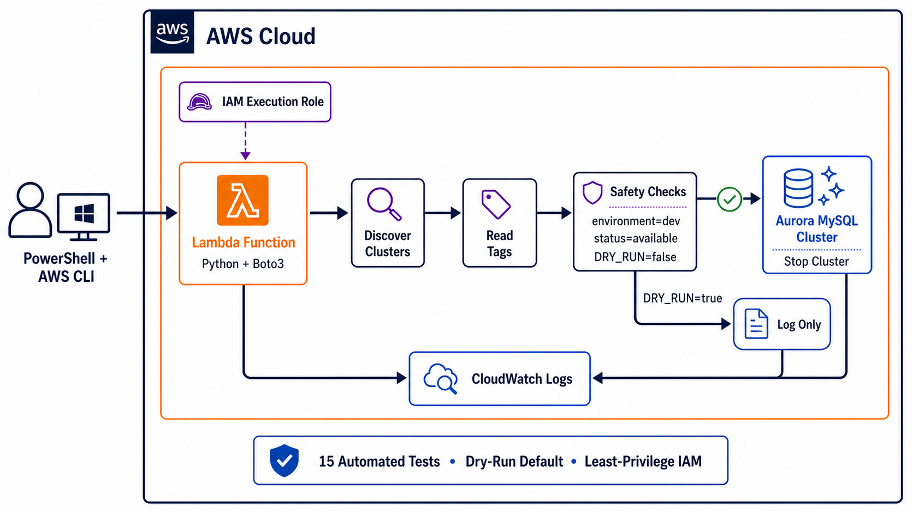

# Python: Automating Amazon Aurora Cost Control with AWS Lambda and Boto3

## How I built, tested, deployed, and safely validated a dry-run-first Lambda function that stops tagged development clusters



Cloud resources do not stop generating costs simply because nobody is using them.

That is especially important in development environments, where a database might be needed during working hours but sit idle at night or over a weekend. Amazon Aurora supports temporarily stopping a DB cluster, which makes it useful for development and test workloads that do not require continuous availability. However, automating that action introduces a serious risk: a poorly designed script could stop the wrong database.

For this project, I built a Python application that discovers Amazon Aurora clusters, reads their tags, checks their status, and stops only clusters that meet a strict set of safety conditions. I then deployed the same logic to AWS Lambda, tested it against a temporary Aurora MySQL cluster, reviewed the results in CloudWatch Logs, and removed the temporary resources after validation.

The finished project combines Python, Boto3, AWS CLI, Amazon RDS and Aurora, Lambda, IAM, CloudWatch Logs, pytest, Git, and GitHub Actions.

The complete source code is available in my public GitHub repository:

**[Python: Aurora Cost Automation](https://github.com/rester12/Python-Aurora-Cost-Automation)**

---

## The problem I wanted to solve

The basic requirement sounded straightforward:

> Find Aurora clusters tagged `environment=dev` and stop them when they are available.

The unsafe implementation would be equally straightforward:

```python
for cluster in all_clusters:
    stop_cluster(cluster)
```

That code has no protection against production resources, incorrectly tagged resources, already-stopped clusters, or incomplete AWS responses. Infrastructure automation should fail safely. If the program cannot prove that a resource is an approved target, it should skip the resource.

I therefore converted the requirement into a guarded workflow:

```text
Discover every DB cluster
    -> retrieve its ARN
    -> retrieve its tags
    -> require environment=dev
    -> require status=available
    -> require DRY_RUN=false
    -> request the cluster stop
    -> record the result
```

The three most important controls are:

1. An exact tag match: `environment=dev`
2. An exact status match: `available`
3. Dry-run mode enabled by default

All three must align before a real stop request can be sent.

---

## Why Aurora is stopped at the cluster level

Aurora is organized around a DB cluster that can contain a writer instance and one or more reader instances. The correct lifecycle operation is therefore `StopDBCluster`, not `StopDBInstance`.

AWS stops the Aurora instances as part of the cluster operation while retaining the cluster's storage and metadata. According to the [Amazon Aurora documentation](https://docs.aws.amazon.com/AmazonRDS/latest/AuroraUserGuide/aurora-cluster-stop-start.html), stopped clusters do not incur DB instance-hour charges, but storage and backup-related charges can continue. AWS also automatically starts a stopped Aurora cluster after seven days so it does not fall behind on required maintenance.

That seven-day behavior is why real cost-automation workflows are normally scheduled instead of treated as one-time actions. A production design can pair this Lambda function with an Amazon EventBridge scheduled rule or EventBridge Scheduler so the function runs nightly, reevaluates the approved development clusters, and stops a qualifying cluster again after an automatic restart. The same tag, status, dry-run, logging, and IAM controls still apply on every scheduled invocation.

---

## Tools and services used

I developed the project on Windows with:

- Windows PowerShell
- Visual Studio Code
- Python and a virtual environment
- Boto3 and Botocore
- pytest
- AWS CLI v2 and AWS CloudShell
- Amazon Aurora MySQL-Compatible Edition
- AWS Lambda
- AWS Identity and Access Management (IAM)
- Amazon CloudWatch Logs
- Git, GitHub, and GitHub Actions

The AWS CLI and Boto3 communicate with the same AWS service APIs, but they serve different roles in the project.

I used the AWS CLI for explicit administrative tasks such as verifying my identity, inspecting resources, creating the temporary lab infrastructure, deploying Lambda, invoking the function, and checking resource status.

I used Boto3—the AWS SDK for Python—inside the application so Python could read AWS responses, evaluate safety rules, and decide whether an action was permitted.

For example, the CLI equivalent of the discovery request is:

```powershell
aws rds describe-db-clusters
```

The application performs the same type of request through Boto3:

```python
rds_client.describe_db_clusters()
```

The important difference is that the Python application can continue from that response into controlled decision-making.

---

## Preparing the local Windows environment

I created an isolated virtual environment so the project's dependencies would not interfere with other Python installations:

```powershell
py -m venv .venv
.\.venv\Scripts\Activate.ps1
python -m pip install --upgrade pip
python -m pip install -r .\requirements-dev.txt
```

The development requirements are:

```text
boto3[crt]
pytest
```

The `[crt]` extra became important because I authenticated locally with the browser-based AWS CLI login flow. Boto3 recognized the login credential provider but initially raised a missing-dependency error. Installing `boto3[crt]` added the AWS Common Runtime dependency required to use those temporary credentials.

Before making AWS calls, I confirmed the active identity and Region:

```powershell
aws sts get-caller-identity
aws configure get region
```

This is a habit worth keeping. Before any cloud automation creates, changes, or deletes resources, I want to know exactly which account, identity, and Region it will affect.

Credentials were never placed in the Python source code or committed to GitHub. Locally, Boto3 used the authenticated AWS credential provider. In Lambda, temporary credentials came from the function's execution role.

---

## Building the application in safe stages

I did not begin with permission to stop a live database. I built the project in increasingly powerful stages:

```text
Local logic -> Read-only discovery -> Tag evaluation -> Dry run -> Controlled stop -> Lambda deployment
```

This approach made each new capability observable and testable before the next one was added.

### 1. Exact tag matching

AWS returns tags as a list of dictionaries. The tag function loops through that data and returns `True` only when both the key and value match:

```python
def has_target_tag(tags, target_key, target_value):
    """Return True when the requested key-value tag is present."""
    for tag in tags:
        key = tag.get("Key")
        value = tag.get("Value")

        if key == target_key and value == target_value:
            return True

    return False
```

Using `.get()` is deliberate. If a tag is incomplete or malformed, the function returns `False` instead of raising a `KeyError`. Untagged resources also return `False`.

This gives the automation a safe default:

> Missing or uncertain metadata never qualifies a resource for a destructive action.

### 2. Pagination-aware discovery

The application uses the RDS paginator rather than assuming all clusters will fit into one API response:

```python
def list_db_clusters(rds_client):
    """Return all DB clusters visible to the current AWS identity."""
    clusters = []
    paginator = rds_client.get_paginator("describe_db_clusters")

    for page in paginator.paginate():
        page_clusters = page.get("DBClusters", [])
        clusters.extend(page_clusters)

    return clusters
```

Pagination might not matter in a small lab account containing one cluster, but supporting it from the beginning prevents the discovery logic from silently ignoring resources as the account grows.

### 3. Retrieving tags through the cluster ARN

The cluster's Amazon Resource Name is required to retrieve its tags:

```python
def get_cluster_tags(rds_client, cluster_arn):
    """Return the tags attached to one DB cluster."""
    response = rds_client.list_tags_for_resource(
        ResourceName=cluster_arn
    )

    return response.get("TagList", [])
```

The main workflow checks that an ARN exists before calling this function. A cluster response without an ARN is logged and skipped.

### 4. Separating evaluation from action

The decision logic is kept separate from the AWS stop call:

```python
def evaluate_cluster(cluster, tags):
    identifier = cluster.get("DBClusterIdentifier", "unknown")
    engine = cluster.get("Engine", "unknown")
    status = cluster.get("Status", "unknown")

    tag_matches = has_target_tag(
        tags,
        target_key="environment",
        target_value="dev",
    )

    is_available = status == "available"
    would_stop = tag_matches and is_available

    return {
        "identifier": identifier,
        "engine": engine,
        "status": status,
        "tag_matches": tag_matches,
        "is_available": is_available,
        "would_stop": would_stop,
    }
```

The core safety expression is intentionally small:

```python
would_stop = tag_matches and is_available
```

Small decision functions are easier to understand and test than AWS calls mixed into a large handler.

### 5. Dry-run mode by default

The program reads a `DRY_RUN` environment variable. If the setting is absent, the function remains in safe mode:

```python
def is_dry_run_enabled():
    """Return True unless DRY_RUN is explicitly disabled."""
    setting = os.getenv("DRY_RUN", "true").strip().lower()

    false_values = {"false", "0", "no"}
    return setting not in false_values
```

This design requires an explicit decision to enable live behavior. A missing variable, capitalization difference, or unexpected value cannot accidentally activate the stop operation.

The action function then handles three possible outcomes:

- `skipped`: the cluster failed one or more safety checks
- `dry-run`: the cluster qualified, but no stop request was sent
- `stop-requested`: the cluster qualified and live mode was explicitly enabled

```python
def apply_cluster_action(rds_client, evaluation, dry_run):
    if not evaluation["would_stop"]:
        return {
            "action": "skipped",
            "reason": "Cluster did not pass all safety checks.",
        }

    if dry_run:
        return {
            "action": "dry-run",
            "reason": "Cluster qualifies, but no stop request was sent.",
        }

    response = rds_client.stop_db_cluster(
        DBClusterIdentifier=evaluation["identifier"]
    )

    return {
        "action": "stop-requested",
        "status": response.get("DBCluster", {}).get(
            "Status",
            "unknown",
        ),
    }
```

The real AWS mutation is isolated behind the two independent guards.

---

## Testing without stopping real databases

Infrastructure automation needs tests that prove both what the code does and what it refuses to do.

I wrote 15 pytest tests covering:

- the exact target tag
- the wrong tag value
- a missing tag key
- an empty tag list
- incomplete tag dictionaries
- an available development cluster
- a stopped development cluster
- an available production cluster
- an untagged cluster
- dry-run mode enabled by default
- explicit disabling of dry-run mode
- no stop call during a dry run
- a stop call for a qualified cluster in live mode
- no stop call for an unqualified cluster
- Lambda handler execution in safe mode

For the action tests, I used a fake RDS client:

```python
class FakeRDSClient:
    """Record stop requests without calling AWS."""

    def __init__(self):
        self.stop_requests = []

    def stop_db_cluster(self, DBClusterIdentifier):
        self.stop_requests.append(DBClusterIdentifier)

        return {
            "DBCluster": {
                "DBClusterIdentifier": DBClusterIdentifier,
                "Status": "stopping",
            }
        }
```

This test proves that a qualified cluster reaches the stop method:

```python
def test_live_mode_calls_stop_api_for_qualified_cluster():
    fake_client = FakeRDSClient()

    evaluation = {
        "identifier": "aurora-dev-cluster",
        "would_stop": True,
    }

    result = apply_cluster_action(
        fake_client,
        evaluation,
        dry_run=False,
    )

    assert result["action"] == "stop-requested"
    assert fake_client.stop_requests == [
        "aurora-dev-cluster"
    ]
```

The companion tests prove that dry-run and unqualified paths never add anything to `stop_requests`.

The final local result was:

```text
15 passed
```

The same suite also runs automatically through GitHub Actions whenever changes are pushed to the repository.

---

## Creating the temporary Aurora test environment

After the read-only code and safety tests passed, I created a temporary Aurora MySQL development cluster in `us-east-1`.

The cluster was configured with:

- one writer instance
- no public accessibility
- a custom DB subnet group spanning multiple Availability Zones
- deletion protection disabled for the disposable lab
- the exact cluster tag `environment=dev`

The cluster tag—not the instance name—was the authorization signal used by the application.

Before every controlled test, I verified the target directly:

```powershell
aws rds describe-db-clusters `
  --db-cluster-identifier aurora-dev-cluster `
  --query "DBClusters[0].Status" `
  --output text
```

I also retrieved the cluster ARN and inspected its tags with `list-tags-for-resource`.

The first live interaction remained a dry run. The application discovered the real cluster and reported:

```text
Has environment=dev: True
Status is available: True
Passed all safety checks: True
Action: dry-run
```

The cluster remained `available`, proving that evaluation did not imply mutation.

Only after that verification did I temporarily set:

```powershell
$env:DRY_RUN = "false"
```

The next execution requested the stop, and the cluster transitioned through `stopping` to `stopped`. I immediately removed the environment variable so subsequent local executions returned to safe mode.

I then ran the program again. Because the cluster status was no longer `available`, the program returned `Action: skipped` and did not make a second stop request.

That repeated run was important: it demonstrated safe, idempotent behavior for the state being managed.

---

## Deploying the workflow to AWS Lambda

The same application supports both local execution and Lambda execution.

The Lambda entry point is intentionally small:

```python
def lambda_handler(event, context):
    """AWS Lambda entry point."""
    dry_run = is_dry_run_enabled()
    rds_client = create_rds_client()

    run_workflow(
        rds_client,
        dry_run,
    )

    return {
        "statusCode": 200,
        "dryRun": dry_run,
        "message": "Aurora workflow completed.",
    }
```

The function was deployed with:

| Setting | Value |
|---|---|
| Handler | `lambda_function.lambda_handler` |
| Memory | 128 MB |
| Timeout | 30 seconds |
| Environment variable | `DRY_RUN=true` |

AWS documents the Python handler as the method Lambda invokes to process an event. The handler continues until it returns, exits, or reaches its timeout. See [Defining Lambda function handlers in Python](https://docs.aws.amazon.com/lambda/latest/dg/python-handler.html).

I first invoked the deployed function while the target cluster was stopped. Lambda discovered it but skipped it because the status guard failed.

For the final end-to-end test, I:

1. Started the Aurora cluster.
2. Waited for both the cluster and writer to become `available`.
3. Invoked Lambda with `DRY_RUN=true`.
4. Confirmed the cluster remained available.
5. Changed the Lambda environment variable to `DRY_RUN=false`.
6. Waited for the configuration update to complete.
7. Invoked Lambda once in live mode.
8. Immediately restored `DRY_RUN=true`.
9. Confirmed the Aurora cluster reached `stopped`.
10. Invoked Lambda again and confirmed the stopped cluster was skipped.

This validated the complete path from Lambda's IAM identity through Boto3, RDS discovery, tag retrieval, status evaluation, the guarded stop request, and logging.

---

## IAM: trust and least-privilege permissions

The Lambda role required two different policy concepts.

The trust policy allows the Lambda service to assume the role:

```json
{
  "Effect": "Allow",
  "Principal": {
    "Service": "lambda.amazonaws.com"
  },
  "Action": "sts:AssumeRole"
}
```

The permissions policy grants only the service actions used by the function:

```text
rds:DescribeDBClusters
rds:ListTagsForResource
rds:StopDBCluster
logs:CreateLogGroup
logs:CreateLogStream
logs:PutLogEvents
```

AWS recommends granting workloads temporary credentials through IAM roles and applying least-privilege permissions. See [Security best practices in IAM](https://docs.aws.amazon.com/IAM/latest/UserGuide/best-practices.html).

For this controlled lab, some RDS permissions use `Resource: "*"`. Before production use, I would narrow the stop permission to approved cluster ARNs wherever the service supports the required resource-level authorization. I would also add an explicit cluster allowlist in the application so tags are not the only approval boundary.

---

## Observability with CloudWatch Logs

Each execution reports:

- whether dry-run mode is enabled
- the number of clusters discovered
- the cluster identifier and engine
- the status before action
- the retrieved tags
- whether each safety check passed
- the selected action
- the AWS response status when a stop is requested

AWS Lambda sends function output to CloudWatch Logs when the execution role has the required logging permissions. The default log group follows the `/aws/lambda/<function-name>` naming pattern. See [Sending Lambda function logs to CloudWatch Logs](https://docs.aws.amazon.com/lambda/latest/dg/monitoring-cloudwatchlogs.html).

These logs gave me evidence for each important state:

```text
Action: dry-run
Action: stop-requested
Action: skipped
```

For a production implementation, I would replace the presentation-oriented `print()` output with structured JSON logging and add CloudWatch metrics and alarms for stop requests, skipped resources, and API failures.

---

## Problems I encountered and how I solved them

The troubleshooting was one of the most valuable parts of the project.

### Boto3 could not use the browser-login credentials

The AWS CLI was authenticated successfully, but Boto3 raised:

```text
MissingDependencyException:
Using the login credential provider requires an additional dependency.
```

Installing the CRT extra resolved it:

```powershell
python -m pip install --upgrade "boto3[crt]"
```

### The default DB subnet group did not exist

The first cluster-creation attempt failed with `DBSubnetGroupNotFoundFault` because the account did not contain an RDS subnet group named `default`.

I listed the subnets in the default VPC, confirmed they spanned multiple Availability Zones, created `aurora-dev-subnet-group`, and retried the cluster command with that subnet-group name.

### A stopped cluster blocked writer deletion

During cleanup, AWS returned `InvalidDBClusterStateFault` when I attempted to delete the writer while the Aurora cluster was stopped.

I started the cluster, waited until both the cluster and writer were available, deleted the writer instance, waited for its deletion, and then deleted the empty cluster.

The lesson was that safe infrastructure cleanup must respect resource dependencies and valid service states.

### Windows PowerShell rejected `utf8NoBOM`

Windows PowerShell 5.1 does not support that encoding name. Because the Lambda test event contained only `{}`, ASCII was safe and avoided a byte-order mark:

```powershell
'{}' | Set-Content `
  -Path ".\test-event.json" `
  -Encoding Ascii
```

### Tests could not import a new function

After the test suite was expanded, pytest could not import `apply_cluster_action`. The updated source had not been saved correctly. I replaced and saved the complete file, verified the function import, cleared Python caches, ran syntax checks, and reran pytest.

This reinforced a simple debugging sequence: verify the file path, verify the source actually contains the symbol, test the import directly, and only then rerun the full suite.

---

## Security and safety decisions

Several design choices were intentionally conservative:

- AWS credentials were never hard-coded or committed.
- The database was not publicly accessible.
- The exact tag key and value were required.
- The exact `available` state was required.
- Dry-run mode was the default locally and in Lambda.
- Live mode was enabled for one monitored invocation and immediately disabled.
- API errors for one cluster were handled without guessing about that resource.
- The stop call was isolated and tested with a fake client.
- Temporary AWS resources were removed after validation.

The strongest principle behind the project was:

> If the automation is uncertain, skip the resource.

---

## Resource cleanup and cost awareness

After end-to-end testing, I deleted:

- the Aurora writer instance
- the Aurora cluster
- unwanted snapshots and retained backups, if present
- the Lambda function
- the CloudWatch log group
- the Lambda inline policy and execution role
- the custom RDS subnet group
- temporary local deployment ZIP and invocation-response files

I kept the source code, tests, policy documents, dependency file, and Git history.

Cleanup matters because a stopped Aurora cluster can still generate storage and backup costs, and AWS automatically restarts a temporarily stopped cluster after seven days. A cloud lab is not complete until its resources have been audited and removed or intentionally retained.

---

## What I would add before production use

This project is a tested portfolio lab, not a production-ready database control system. A production version should include:

- an explicit allowlist of approved cluster identifiers or ARNs
- tighter IAM resource restrictions
- structured JSON logging
- custom CloudWatch metrics and alarms
- EventBridge scheduling that accounts for Aurora's automatic restart after seven days
- separate start and recovery automation
- formal approval before live-mode changes
- tag configuration outside the source code
- engine and topology eligibility checks
- integration tests in an isolated AWS account
- infrastructure as code for repeatable deployment
- version-pinned packaged dependencies
- documented ownership, rollback, and incident procedures

I would also reconsider whether an environment variable alone should enable a production stop action. A stronger design could require both a deployment-time configuration and a separate approval signal.

---

## What I learned

This project moved beyond writing a short Boto3 script. It required me to think about how cloud automation should behave when data is missing, state changes between requests, credentials are temporary, service dependencies affect cleanup, and the same code must run locally and inside Lambda.

My main lessons were:

1. AWS CLI and Boto3 expose similar service operations, but Boto3 makes those operations programmable.
2. Aurora lifecycle actions operate at the cluster level.
3. Tags are useful targeting metadata, but destructive automation needs additional safeguards.
4. Dry-run behavior should be the default, not an optional afterthought.
5. Separating evaluation from action makes code easier to test and review.
6. Tests must prove that unsafe paths do not call AWS.
7. IAM trust policies and permissions policies solve different problems.
8. CloudWatch logs are part of the operational design, not just a debugging convenience.
9. Repeated execution is an important part of end-to-end validation.
10. Resource cleanup is part of the engineering work.

The result is a small but complete cloud automation system: designed defensively, tested locally, deployed to Lambda, validated against a real Aurora cluster, observed through CloudWatch, published to GitHub, and cleaned up afterward.

---

## Project repository

The full Python source, tests, IAM policy, Lambda trust policy, GitHub Actions workflow, and setup documentation are available here:

**[github.com/rester12/Python-Aurora-Cost-Automation](https://github.com/rester12/Python-Aurora-Cost-Automation)**

---

## Suggested Medium tags

`AWS` · `Python` · `Cloud Computing` · `DevOps` · `Serverless`
