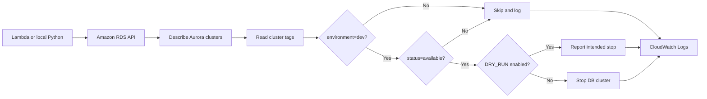

# Aurora Cost Automation

A safety-first AWS Lambda project that discovers Amazon Aurora clusters, reads their tags, and stops only clusters that meet both conditions:

- the cluster has the exact tag `environment=dev`
- the cluster status is `available`

The function defaults to dry-run mode, so qualifying clusters are reported without being changed until live mode is explicitly enabled.

## What this project demonstrates

- AWS SDK for Python (Boto3)
- AWS Lambda and CloudWatch Logs
- Least-privilege IAM permissions
- Aurora cluster-level operations
- Pagination with the RDS API
- Defensive tag and status checks
- Unit testing with fake AWS clients
- Safe infrastructure automation through dry-run defaults

## Architecture



## Safety controls

The stop request is sent only when all of the following are true:

1. The RDS resource is returned as a DB cluster.
2. Its ARN is present and its tags can be retrieved.
3. The exact `environment=dev` tag exists.
4. Its current status is `available`.
5. `DRY_RUN` has been explicitly set to a false value.

If `DRY_RUN` is missing, the application uses `true`. Accepted false values are `false`, `0`, and `no`.

## Project structure

```text
aurora-cost-automation/
├── .github/workflows/tests.yml
├── tests/test_lambda_function.py
├── .gitignore
├── iam-policy.json
├── lambda-trust-policy.json
├── lambda_function.py
├── README.md
└── requirements-dev.txt
```

## Prerequisites

- Windows PowerShell
- Python 3.13 or newer
- AWS CLI v2
- An AWS identity authorized to inspect the target RDS resources
- A configured AWS Region

For local development with credentials created by `aws login`, `boto3[crt]` supplies the AWS Common Runtime dependency required by the login credential provider.

## Local setup on Windows

```powershell
py -m venv .venv
.\.venv\Scripts\Activate.ps1
python -m pip install --upgrade pip
python -m pip install -r .\requirements-dev.txt
```

Confirm the active AWS identity and Region before making API calls:

```powershell
aws sts get-caller-identity
aws configure get region
```

Never store AWS credentials in this repository.

## Run the tests

```powershell
python -m pytest -v
```

The suite covers tag matching, malformed and missing tags, cluster status checks, dry-run defaults, prevention of unsafe stop calls, qualified live-mode behavior, and the Lambda handler.

## Run locally in dry-run mode

Dry-run mode is the default:

```powershell
Remove-Item Env:DRY_RUN -ErrorAction SilentlyContinue
python .\lambda_function.py
```

Expected actions are `dry-run` for a qualifying cluster and `skipped` for any cluster that fails a safety check.

## Run locally in live mode

> Warning: this can stop every `available` Aurora cluster in the configured account and Region that is tagged exactly `environment=dev`.

```powershell
$env:DRY_RUN = "false"
python .\lambda_function.py
Remove-Item Env:DRY_RUN
```

Restore safe mode immediately after the controlled run.

## Lambda deployment outline

The deployment package contains `lambda_function.py` at the ZIP root. Configure Lambda with:

| Setting | Value |
|---|---|
| Handler | `lambda_function.lambda_handler` |
| Runtime | A supported Python runtime |
| Timeout | 30 seconds |
| Memory | 128 MB |
| Environment | `DRY_RUN=true` |

The runtime includes Boto3, so this small deployment does not package the local Windows virtual environment. Use `lambda-trust-policy.json` as the role trust policy and `iam-policy.json` as the starting permissions policy.

## IAM permissions

The function needs these RDS actions:

- `rds:DescribeDBClusters`
- `rds:ListTagsForResource`
- `rds:StopDBCluster`

It also needs permission to create and write its CloudWatch Logs streams. Review and narrow resource scope for the target AWS account before production use.

## Verification performed

This project was tested end to end in `us-east-1` with a tagged Aurora development cluster:

- local dry run identified the qualifying cluster without changing it
- local live mode requested the cluster stop
- a second run skipped the stopped cluster
- Lambda dry-run mode preserved the available cluster
- Lambda live mode stopped the qualifying cluster
- CloudWatch Logs recorded the decisions and action
- all 15 automated tests passed
- temporary AWS lab resources were removed after validation

## Production considerations

Before adapting this lab for production, consider restricting `StopDBCluster` to approved cluster ARNs, using deployment automation, adding alarms, using structured logs, validating engine eligibility, adding an explicit allowlist, scheduling through EventBridge, and requiring a change-control process for live mode.
