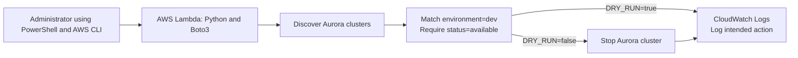

# Python: Aurora Cost Automation

## Overview

This hands-on portfolio project demonstrates how Python and AWS Lambda can automate cost-control actions for Amazon Aurora. The function uses Boto3 to discover Aurora DB clusters, retrieve their tags, evaluate their current status, and stop only clusters tagged exactly `environment=dev` while they are `available`.

The automation defaults to dry-run mode. A qualifying cluster is reported without being changed until live mode is explicitly enabled. The project was validated locally and in AWS Lambda, with execution decisions recorded in CloudWatch Logs.

This is a personal cloud-automation lab designed to practice Python, AWS SDK usage, IAM, Lambda, testing, and defensive infrastructure automation. It is not presented as a production deployment.

## Medium Article

Read the complete project walkthrough, implementation details, troubleshooting notes, and lessons learned:

[Python: Automating Amazon Aurora Cost Control with AWS Lambda and Boto3](https://medium.com/@rester.mcglown/python-automating-amazon-aurora-cost-control-with-aws-lambda-and-boto3-b683187b3c60)

## Architecture



## Technologies Used

- Python and pytest
- Boto3 and Botocore
- AWS CLI v2 and AWS CloudShell
- AWS Lambda
- Amazon Aurora MySQL-Compatible Edition
- AWS Identity and Access Management (IAM)
- Amazon CloudWatch Logs
- Git and GitHub Actions
- Windows PowerShell and Visual Studio Code

## Project Objectives

- Discover Aurora DB clusters through the paginated RDS API.
- Retrieve tags by using each cluster's Amazon Resource Name (ARN).
- Match the exact safety tag `environment=dev`.
- Require the cluster status to be `available` before requesting a stop.
- Default to dry-run mode so normal execution cannot stop a cluster.
- Isolate the real `stop_db_cluster()` call behind explicit safety checks.
- Handle missing ARNs, missing tags, malformed tags, and AWS API errors safely.
- Deploy the tested code to AWS Lambda with a least-privilege execution role.
- Record evaluation and action results in CloudWatch Logs.
- Verify behavior locally, with mocked AWS calls, and against a temporary Aurora cluster.

## Repository Contents

```text
.
|-- .github/
|   `-- workflows/
|       `-- tests.yml
|-- tests/
|   `-- test_lambda_function.py
|-- .gitattributes
|-- .gitignore
|-- iam-policy.json
|-- lambda-trust-policy.json
|-- lambda_function.py
|-- MEDIUM_ARTICLE.md
|-- README.md
`-- requirements-dev.txt
```

## Safety Design

The function sends a stop request only when all of these conditions are true:

1. The resource is returned by `describe_db_clusters()`.
2. The cluster response contains an ARN.
3. Its tags can be retrieved successfully.
4. The exact tag `environment=dev` exists.
5. The cluster status is `available`.
6. `DRY_RUN` has been explicitly set to a false value.

If `DRY_RUN` is absent, it defaults to `true`. Accepted false values are `false`, `0`, and `no`.

The core decision is intentionally strict:

```python
would_stop = tag_matches and is_available
```

If the automation is uncertain, it skips the resource rather than guessing.

## Local Development Setup

The project was developed on Windows. From PowerShell in the repository root:

```powershell
py -m venv .venv
.\.venv\Scripts\Activate.ps1
python -m pip install --upgrade pip
python -m pip install -r .\requirements-dev.txt
```

For local development with credentials created by `aws login`, `boto3[crt]` supplies the AWS Common Runtime dependency required by the login credential provider.

Confirm the active AWS identity and Region before making API calls:

```powershell
aws sts get-caller-identity
aws configure get region
```

AWS credentials, session tokens, account-specific resource identifiers, deployment ZIP files, and local environment files must not be committed.

## Testing

Run the complete test suite:

```powershell
python -m pytest -v
```

The 15 automated tests validate:

- exact tag matches
- incorrect tag keys and values
- empty and malformed tag data
- available and stopped cluster states
- dry-run mode enabled by default
- explicit disabling of dry-run mode
- prevention of stop calls during dry runs
- prevention of stop calls for unqualified clusters
- the stop call for a qualified cluster in live mode
- Lambda handler execution in safe mode

The tests use a fake RDS client for the stop operation, so the unit test suite does not modify AWS resources.

## Local Execution

Dry-run mode is the default:

```powershell
Remove-Item Env:DRY_RUN -ErrorAction SilentlyContinue
python .\lambda_function.py
```

A qualifying cluster produces an `Action: dry-run` result. A cluster that fails any guard produces `Action: skipped`.

Live mode must be enabled explicitly:

```powershell
$env:DRY_RUN = "false"
python .\lambda_function.py
Remove-Item Env:DRY_RUN
```

> Warning: live mode can stop every `available` Aurora cluster in the configured AWS account and Region that is tagged exactly `environment=dev`.

Safe mode should be restored immediately after a controlled live test.

## Lambda Deployment

The deployment package contains `lambda_function.py` at the root of the ZIP file. The function uses these settings:

| Setting | Value |
|---|---|
| Handler | `lambda_function.lambda_handler` |
| Runtime | Supported Python runtime |
| Timeout | 30 seconds |
| Memory | 128 MB |
| Environment variable | `DRY_RUN=true` |

The Lambda Python runtime includes Boto3, so the local Windows virtual environment is not added to the deployment package.

[`lambda-trust-policy.json`](lambda-trust-policy.json) allows the Lambda service to assume the execution role. [`iam-policy.json`](iam-policy.json) provides the RDS and CloudWatch Logs actions used by the function.

## IAM Permissions

The Lambda execution role uses these RDS actions:

- `rds:DescribeDBClusters`
- `rds:ListTagsForResource`
- `rds:StopDBCluster`

It also permits the function to create its CloudWatch log group and stream and to write log events. The included policy is a lab starting point. Before production use, the stop permission should be narrowed to approved cluster ARNs wherever the IAM service supports the intended resource-level restriction.

## End-to-End Validation

The project was tested in `us-east-1` with a temporary Aurora development cluster:

- Created an Aurora cluster and writer instance through AWS CLI commands in CloudShell.
- Applied the exact cluster tag `environment=dev`.
- Confirmed a local dry run identified the cluster without modifying it.
- Enabled local live mode and verified the cluster entered the stopping state.
- Ran the program again and confirmed the stopped cluster was skipped.
- Deployed the code to Lambda with `DRY_RUN=true`.
- Confirmed the Lambda dry run preserved an available cluster.
- Enabled Lambda live mode for one controlled invocation and verified the cluster stopped.
- Restored Lambda to dry-run mode immediately after the test.
- Reviewed the decisions and action in CloudWatch Logs.
- Removed temporary Aurora, Lambda, log group, IAM role, and subnet-group resources after validation.
- Passed all 15 local tests and the GitHub Actions test workflow.

## Troubleshooting Highlights

- **Boto3 could not use browser-login credentials:** Installed `boto3[crt]` so Botocore could use the login credential provider.
- **The default DB subnet group did not exist:** Created a custom RDS DB subnet group using subnets from multiple Availability Zones.
- **A stopped Aurora cluster blocked writer deletion:** Started the cluster, waited for the cluster and writer to become available, then deleted the writer before deleting the cluster.
- **Windows PowerShell rejected `utf8NoBOM`:** Used ASCII for the small `{}` Lambda test-event file because Windows PowerShell 5.1 does not provide that encoding name.
- **Tests could not import a new function:** Replaced and saved the complete source file, cleared cached files, and reran syntax checks before pytest.
- **GitHub rejected password authentication:** Used Git Credential Manager's browser-based OAuth flow instead of a password or manually pasted token.

## Security Considerations

- Never commit AWS access keys, secret keys, session tokens, database passwords, private keys, account numbers, or live resource ARNs.
- Keep `DRY_RUN=true` in Lambda except during an approved and monitored live invocation.
- Use exact resource tags and consider adding an explicit cluster allowlist.
- Restrict the execution role to the minimum required actions and resource scope.
- Do not expose the Aurora database publicly when control-plane API access is sufficient.
- Review CloudWatch Logs and alarms for unexpected automation behavior.
- Delete temporary cloud resources after testing to avoid unnecessary charges.

## Lessons Learned

- AWS CLI and Boto3 can call the same service APIs, but Boto3 allows Python to evaluate responses and automate decisions.
- Aurora lifecycle operations are performed at the cluster level rather than by stopping individual Aurora instances.
- Dry-run defaults and independent guard conditions reduce the risk of unsafe infrastructure automation.
- Mocked clients make it possible to verify action logic without calling real AWS services.
- Pagination is important even when a lab account currently contains only one cluster.
- IAM trust policies and permissions policies solve different problems and are both required for Lambda execution.
- End-to-end validation should include the successful action, repeated execution, logs, tests, and resource cleanup.

## Production Considerations

AWS automatically restarts a stopped Aurora cluster after seven days so it does not fall behind on required maintenance. A recurring cost-control design should therefore invoke the Lambda function on a deliberate Amazon EventBridge schedule so approved development clusters are evaluated again after an automatic restart. Storage and backup-related charges can also continue while a cluster is stopped. See [Stopping and starting an Amazon Aurora DB cluster](https://docs.aws.amazon.com/AmazonRDS/latest/AuroraUserGuide/aurora-cluster-stop-start.html) for the current service behavior and limitations.

Before adapting this lab for production, also consider deployment automation, structured logging, alarms, engine eligibility checks, an explicit cluster allowlist, tighter IAM resource scope, change-control approval for live mode, scheduling around maintenance windows and developer working hours, and a separate start/recovery workflow.
